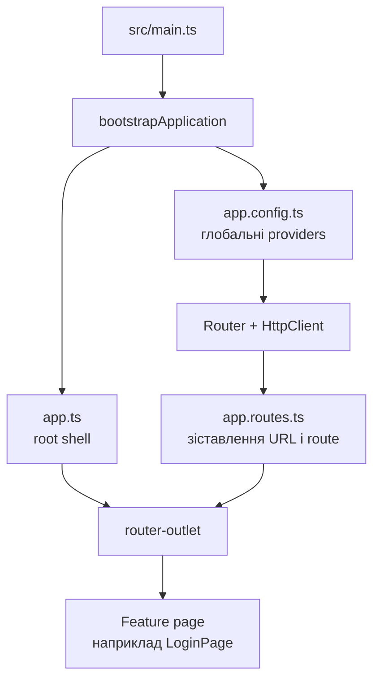

[⬅️](../VaultNote_Atlas.md)

## 📝 TL;DR

Angular application під час запуску збирається з root component, глобальних
providers і списку browser routes. Root shell створюється один раз, а routing
підставляє в його `<router-outlet />` потрібну feature page, наприклад `/login`.

Це концептуальне пояснення до нотатки
[про bootstrap, routing та application shell](Angular-bootstrap-routing-та-application-shell.md).

## Загальна картина



Послідовність така:

1. `main.ts` запускає Angular application.
2. Angular читає `app.config.ts` і готує зареєстровані providers.
3. Створюється root component — application shell.
4. Router читає поточний URL і знаходить відповідний route.
5. Компонент route вставляється в `<router-outlet />` усередині shell.

Для Java/Spring розробника це можна приблизно зіставити так:

- `main.ts` — аналог application entry point і `SpringApplication.run(...)`;
- `app.config.ts` — аналог частини `@Configuration` та налаштування
  ApplicationContext;
- `app.routes.ts` — аналог web routing infrastructure;
- `app.ts` — root UI layout, а не backend controller.

Це зіставлення допомагає зрозуміти ролі, але не означає, що Angular запускає
Spring або обробляє HTTP-запити так само, як backend.

## Глобальні providers

### Що таке provider

Provider — це опис того, як Angular має отримати певну залежність: сервіс,
конфігурацію, interceptor або інший об'єкт. Angular використовує власну
систему dependency injection і створює залежності тоді, коли вони потрібні.

Глобальні providers реєструються під час bootstrap на рівні всієї application.
Тому різні компоненти й services можуть отримати одну й ту саму залежність через
constructor injection або `inject()`.

Глобальний provider не означає «глобальна змінна». Це контрольована залежність,
якою керує Angular injector. За замовчуванням application-level services
живуть протягом життя application, але Angular також підтримує providers на
рівні route або компонента.

Отримання залежності через Angular constructor injection схоже на constructor
injection у Spring. Виклик `inject()` виконує ту саму базову роль — просить
injector надати залежність, але використовує функціональний Angular API.

### Providers у нашому проєкті

У `app.config.ts` зараз підключені:

- `provideRouter(routes)` — реєструє Angular Router і його routing behavior;
- `provideHttpClient()` — реєструє HTTP client, яким користується
  `auth-api.service.ts`.

`provideHttpClient()` можна приблизно порівняти з реєстрацією та налаштуванням
`RestClient` або `WebClient` у Spring. HTTP interceptors Angular за роллю
нагадують client interceptors чи фільтри, які додають загальну поведінку до
запитів.

`provideRouter(routes)` ближчий до підключення web routing infrastructure у
Spring MVC — наприклад, `DispatcherServlet` і `HandlerMapping` — але Angular
маршрутизує UI-навігацію в браузері.

Пізніше тут можуть з'явитися HTTP interceptors для access token, refresh і
CSRF, а також інші application-wide auth providers.

### Аналогія зі Spring

Найближча аналогія — Spring ApplicationContext і частина `@Configuration` /
`@Bean`-реєстрацій:

- Spring реєструє beans у ApplicationContext;
- Angular реєструє providers в injector;
- Spring injection отримує bean;
- Angular injection отримує залежність.

Application-level provider за часом життя приблизно нагадує singleton bean у
Spring, але scope Angular залежить від місця реєстрації. Provider також може
описувати не лише готовий об'єкт, а фабрику, token або функціональну
конфігурацію.

Аналогія не повна: Angular injector працює у browser application, а Spring
ApplicationContext — на backend.

## Browser routing

### Що таке browser routing

Browser routing — це client-side зіставлення URL із Angular component. Router
слухає зміни адреси, історії браузера та програмну навігацію, після чого
активує відповідний route component.

Наприклад, у нашому `app.routes.ts`:

```typescript
{
  path: 'login',
  loadComponent: () => import('./auth/login-page').then(({ LoginPage }) => LoginPage)
}
```

Коли URL стає `/login`, Angular завантажує `LoginPage` і відображає його у
`<router-outlet />`. Зазвичай повна HTML-сторінка не перезавантажується.

`loadComponent` робить route lazy: код login feature можна завантажити лише
тоді, коли користувач переходить на цей route.

### Аналогія зі Spring MVC

Роль route можна порівняти з `@RequestMapping`: обидва правила зіставляють
шлях із обробником. На рівні Spring MVC Angular `app.routes.ts` найближчий до
набору mapping-правил, які використовує `HandlerMapping`. Але механізм різний:

- Spring MVC маршрутизує HTTP-запит до backend controller;
- Angular Router перемикає component усередині вже завантаженої browser
  application.

Angular route guard може не дозволити навігацію для неавторизованого
користувача. За роллю guard нагадує security filter або authorization check,
але це лише frontend UX: реальний захист даних і endpoint має залишатися на
backend.

## Root shell

Root shell — це верхній компонент Angular application, який створюється під час
bootstrap і зазвичай живе до закриття або перезавантаження сторінки.

У нашому проєкті shell складається з:

- `app.ts` — root standalone component;
- `app.html` — його template;
- `<router-outlet />` — місце для активної route page.

Shell може містити спільні для всіх екранів елементи: header, navigation,
глобальний error outlet або layout. Конкретні екрани, як `LoginPage`, не треба
змішувати з root template: вони підставляються router-ом у outlet.

Найближча аналогія у server-side Java UI — спільний layout або template із
місцем для content fragment, наприклад layout у Thymeleaf. `<router-outlet />`
є таким місцем, але його вміст перемикається client-side Router-ом.

### Чим shell не є

Root shell — це не backend controller і не application service. Він не має
обробляти HTTP-запити чи містити бізнес-workflow. Його відповідальність —
утримувати спільну UI-оболонку та місце для поточного route component.

## Що відбувається при відкритті `/login`

1. Браузер завантажує `index.html` і JavaScript bundle.
2. `main.ts` викликає bootstrap Angular application.
3. Angular створює providers із `app.config.ts`.
4. Створюється `App` — root shell.
5. Router бачить URL `/login`.
6. Angular lazy-loads `LoginPage`.
7. `LoginPage` відображається всередині `<router-outlet />`.
8. Коли login page викликає `auth-api.service.ts`, той отримує `HttpClient`
   через глобальний provider `provideHttpClient()`.

У Spring-паралелі це схоже на послідовність старту application context,
підключення web routing і виконання запиту до controller, але останній крок
тут не є HTTP-запитом до backend: Angular лише активує browser component.

## Де це у нашому проєкті

- `src/main.ts` — application bootstrap;
- `src/app/app.config.ts` — application-wide providers;
- `src/app/app.routes.ts` — browser routes;
- `src/app/app.ts` — root shell component;
- `src/app/app.html` — shell template і `<router-outlet />`;
- `src/app/auth/login-page.ts` — route feature page;
- `src/app/auth/auth-api.service.ts` — HTTP client, який використовує
  зареєстрований `HttpClient`; за роллю нагадує gateway над `RestClient` або
  `WebClient`.
