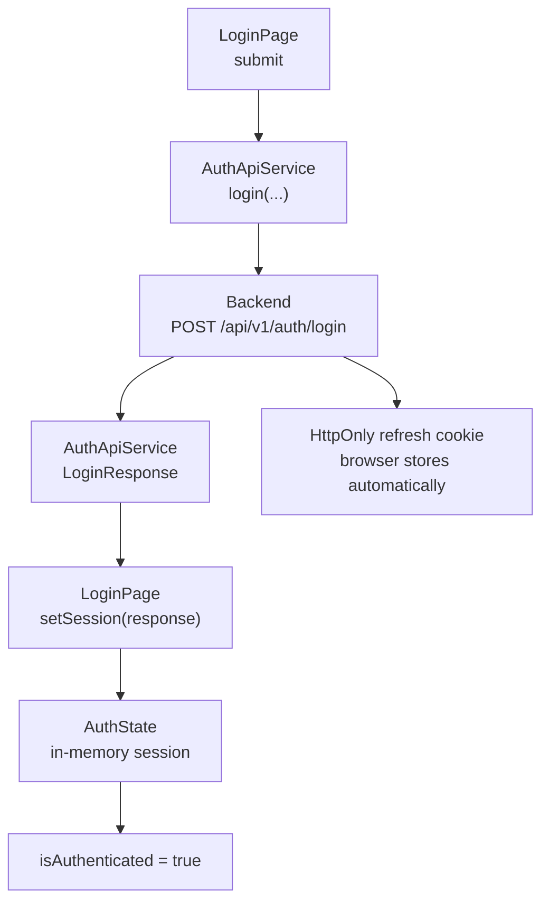

[⬅️](../VaultNote_Atlas.md)

## 📝 TL;DR

`src/app/auth/` — перша feature-папка Angular frontend для authentication flow.
Зараз вона містить контракт даних, API service і login page з reactive form,
frontend-валідацією, підключеним submit до backend та in-memory access-token
state; CSRF flow і повна обробка помилок будуть додані наступними кроками.

Це частина нотатки [про структуру Angular workspace](Структура-Angular-workspace.md).

## Поточні файли

### `auth.models.ts`

Frontend-моделі login request/response та raw API response. Вони описують
контракт даних між Angular і backend, але не є JPA entities.

Найближча аналогія — backend DTO або Java `record`: модель переносить дані між
межами, але не відповідає за persistence чи business workflow.

### `auth-api.service.ts`

HTTP client для `POST /api/v1/auth/login`. Service також мапить backend
`snake_case` у frontend `camelCase` і використовує `withCredentials`, щоб
браузер міг прийняти refresh-token cookie.

Його можна порівняти з невеликим gateway над `RestClient` або `WebClient`: він
відповідає за HTTP-виклик і мапінг відповіді, але не повинен перетворюватися на
backend-style сервіс із бізнес-workflow.

### `login-page.ts`

Клас і presentation logic login page, яка завантажується маршрутом `/login`.

Компонент використовує окремий `templateUrl` і `styleUrl`, тому TypeScript-файл
не містить великого inline HTML-шаблону.

Вона містить:

- reactive form з `email` і `password`;
- frontend-валідацію, синхронізовану з базовими обмеженнями `LoginRequest`;
- submit через `AuthApiService.login()`;
- loading-стан кнопки під час HTTP-запиту.

### `login-page.html`

Зовнішній Angular template login page. Він містить form controls, validation
messages, submit button, OAuth placeholders і доступні атрибути на кшталт
`aria-invalid` та `aria-describedby`.

Це UI view із presentation logic, а не аналог `@RestController`: компонент
працює у браузері й відображає стан форми.

## In-memory `AuthState`

Після успішного `POST /api/v1/auth/login` backend повертає короткоживучий JWT
access token у JSON-відповіді. `AuthState` приймає цей `LoginResponse` і тримає
потрібний для frontend session state в Angular signal:

- `accessToken` — значення для майбутнього `Authorization: Bearer ...` header;
- `tokenType` — тип токена, зараз `Bearer`;
- `expiresAt` — локально обчислений момент завершення дії токена;
- `isAuthenticated` — похідний стан для UI та майбутніх route guards.

Цей state живе лише в пам'яті singleton-сервісу Angular. Токен навмисно не
записується в `localStorage`, `sessionStorage`, cookie або URL. Тому повне
перезавантаження сторінки очищує access token: токен не залишається в
persistent browser storage і його потрібно отримати заново через refresh flow.
Це відповідає рішенню [ADR 010](../../docs/modules/ROOT/pages/adr/010-jwt-and-refresh-token-delivery.adoc).

## Аналогія з backend `SecurityContext`

`AuthState` можна уявляти як frontend-аналог контексту автентифікації, але це не
той самий security boundary:

| Backend `SecurityContext`                              | Frontend `AuthState`                                  |
| ------------------------------------------------------ | ----------------------------------------------------- |
| Створюється security filter chain після перевірки JWT. | Заповнюється після успішного login response.          |
| Діє в межах конкретного HTTP-запиту.                   | Живе протягом життя Angular application.              |
| Є довіреним контекстом для backend authorization.      | Є локальним state для UI, interceptor і route guards. |
| Містить перевірену `Authentication`.                   | Містить access token і метадані його expiry.          |

Тому `isAuthenticated = true` на frontend означає лише, що в пам'яті є session.
Це не доводить, що token ще дійсний або що користувач має право на конкретну
операцію. Остаточне рішення завжди приймає backend: він перевіряє підпис,
issuer, expiry і права з JWT, а за порушення повертає `401` або `403`.

Поточний login flow має таку послідовність:

`AuthApiService` відповідає лише за HTTP і мапінг `snake_case` у `camelCase`, а
`AuthState` — лише за поточну access-сесію. Interceptor, який читатиме цей state,
додаватиме bearer header, а refresh після перезавантаження та завершення TTL
буде окремим наступним кроком. Refresh token JavaScript не читає: він
залишається в `HttpOnly` cookie.

## Наступний крок

У login feature потрібно додати:

- обробку backend validation errors, `401` та інших невдалих login responses;
- interceptor, який додаватиме access token із `AuthState` до захищених запитів;
- підготовку до refresh через `HttpOnly` cookie та CSRF flow.

Пізніше тут або у спільному auth infrastructure з'являться HTTP interceptors,
route guards і logout behavior. Наступний interceptor використовуватиме
`AuthState` для захищених HTTP-запитів.
