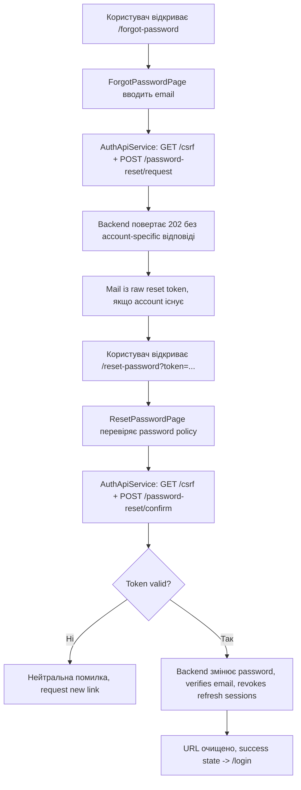

[⬅️](../VaultNote_Atlas.md)

## 📝 TL;DR

`src/app/auth/` — feature-папка Angular frontend для authentication flow.
Вона містить OpenAPI-моделі, API service, login/register/email-verification та
password-recovery pages, in-memory access-token state, CSRF flow, bearer
interceptor і автоматичний single-flight refresh через `HttpOnly` cookie.

Це частина нотатки [про структуру Angular workspace](Структура-Angular-workspace.md).

## Поточні файли

### `auth.models.ts`

Згенеровані з OpenAPI raw API types описують backend-контракт. Поверх них
`auth.models.ts` містить application-facing моделі login, registration і
password-recovery request/response з frontend-іменами у `camelCase`. Усі ці
моделі описують контракт даних між Angular і backend, але не є JPA entities.

Найближча аналогія — backend DTO або Java `record`: модель переносить дані між
межами, але не відповідає за persistence чи business workflow.

### `auth-api.service.ts`

HTTP gateway для auth endpoints: login, registration, email verification,
password reset, refresh, logout і current user. Перед state-changing запитом
service гарантує наявність CSRF cookie, мапить backend `snake_case` у frontend
`camelCase` і використовує `withCredentials`, щоб браузер міг прийняти та
надсилати refresh-token cookie.

Його можна порівняти з невеликим gateway над `RestClient` або `WebClient`: він
відповідає за HTTP-виклик і мапінг відповіді, але не повинен перетворюватися на
backend-style сервіс із бізнес-workflow.

### `login-page.ts`

Клас і presentation logic login page, яка завантажується маршрутом `/login`.

Компонент використовує окремий `templateUrl` і `styleUrl`, тому TypeScript-файл
не містить великого inline HTML-шаблону.

Вона містить:

- reactive form з `email` і `password`;
- frontend-валідацію, синхронізовану з базовими обмеженнями `LoginRequest`;
- submit через `AuthApiService.login()`;
- loading-стан кнопки під час HTTP-запиту.

### `login-page.html`

Зовнішній Angular template login page. Він містить form controls, validation
messages, submit button, OAuth placeholders і доступні атрибути на кшталт
`aria-invalid` та `aria-describedby`.

Це UI view із presentation logic, а не аналог `@RestController`: компонент
працює у браузері й відображає стан форми.

### Інші auth pages

Усі auth pages завантажуються lazy через `app.routes.ts` і використовують
спільний `auth-shell` та однаковий visual style:

- `/register` — display name, email, password і confirmation; після успішної
  реєстрації показує інструкцію перевірити inbox;
- `/verify-email?token=...` — loading, success та invalid/expired-link states;
  verification token передається лише в API-запит і не стає access-сесією;
- `/forgot-password` — email form для запиту reset link і generic success state;
- `/reset-password?token=...` — новий пароль, confirmation, password policy,
  visibility controls і states для success або invalid/expired/used token;
- `/me` — authenticated screen із current user і logout.

`ForgotPasswordPage` навмисно не показує, чи існує введений email. Після
успішного `202 Accepted` він показує нейтральне повідомлення на кшталт:
«Якщо для цієї адреси існує акаунт, ми надіслали посилання для скидання
пароля».

`ResetPasswordPage` тримає raw token лише в поточному component state. Він не
записується в `localStorage`, `sessionStorage` або інший persistent state. Після
успішного reset Angular замінює URL без query-параметра `token` через
`replaceUrl`, а користувач переходить на login.

### `auth-state.service.ts`

`AuthStateService` — application-wide in-memory state для поточної Angular
сесії. Він зберігає access token, `tokenType` і `expiresIn` лише в signal-пам'яті
та надає `setSession`, `clearSession`, `accessToken` і `isAuthenticated`.

Access token навмисно не записується в `localStorage`, `sessionStorage`, URL або
інше persistent browser storage. Після повного перезавантаження сторінки цей
state порожній, а відновлення виконується через refresh cookie.

Цей Angular state не є backend `HttpSession` і не є Spring Security
`SecurityContext`. Це локальний frontend cache для access JWT. Backend
залишається stateless щодо access authentication, але має persistent refresh
session: hash refresh token-а зберігається в PostgreSQL, а raw token живе в
`HttpOnly` cookie браузера.

## Що означає CSRF bootstrap та refresh/interceptor

Цей крок з'єднує login API, browser cookies і access-token state в один
безпечний flow. Тут є два різні механізми:

- CSRF захищає state-changing запити, які використовують cookies;
- bearer interceptor додає access JWT до захищених запитів і запускає refresh
  після `401`.

### CSRF bootstrap

`CsrfService` перед login або refresh викликає `GET /csrf` з
`withCredentials: true`. Backend відповідає CSRF token і встановлює readable
cookie `XSRF-TOKEN`.

Refresh cookie має іншу властивість: він називається
`vaultnote_refresh_token`, є `HttpOnly` і недоступний JavaScript. Це правильно:
frontend не повинен читати refresh token, але браузер може автоматично надсилати
його backend за умови `withCredentials`.

`csrf.interceptor.ts` читає `XSRF-TOKEN` cookie та для `POST`, `PUT`, `PATCH` і
`DELETE` додає header `X-XSRF-TOKEN`. Саме пару cookie + header перевіряє
Spring Security.

### Bearer interceptor

`auth.interceptor.ts` додає до backend-запитів:

- `Authorization: Bearer <access-token>` із `AuthStateService`;
- `withCredentials: true`, щоб працював refresh cookie.

Public auth endpoints (`login`, `refresh`, `logout`, registration і CSRF
bootstrap) не отримують зайвий bearer token і не запускають refresh loop.
Password-reset request і confirm також є public endpoints для Bearer
authentication, але залишаються state-changing CSRF-запитами.

### Refresh після `401`

Якщо захищений запит повернув `401`, interceptor передає refresh у
`AuthRefreshService`:

1. service викликає `POST /api/v1/auth/refresh`;
2. backend перевіряє `HttpOnly` refresh cookie, відкликає старий token і видає
   новий access token та нову cookie;
3. нова access-сесія записується в `AuthStateService`;
4. початковий HTTP-запит повторюється з новим bearer token.

`AuthRefreshService` використовує single-flight поведінку. Якщо кілька запитів
одночасно отримали `401`, вони очікують один спільний refresh, а не створюють
кілька refresh-запитів і не провокують зайві rotation операції.

Якщо refresh завершився помилкою, access state очищується. Frontend більше не
вважає користувача authenticated і може передати керування login flow.

### Послідовність login flow

1. `LoginPage` передає credentials в `AuthApiService`.
2. `CsrfService` отримує CSRF cookie, якщо вона ще не підготовлена.
3. CSRF interceptor додає `X-XSRF-TOKEN` до login-запиту.
4. Backend повертає access JWT і встановлює `HttpOnly` refresh cookie.
5. `LoginPage` передає response в `AuthStateService`.
6. Наступні protected requests отримують bearer header автоматично.
7. Після завершення TTL interceptor оновлює access token через refresh і
   повторює початковий запит.

## Password recovery flow

Password recovery — це окремий public flow. Він не використовує email-
verification token повторно, але після успішного reset може підтвердити email
невіріфікованого local account.



### Request reset

`ForgotPasswordPage` надсилає email на
`POST /api/v1/auth/password-reset/request`. `AuthApiService` спочатку виконує
CSRF bootstrap, а interceptor додає `X-XSRF-TOKEN` і `withCredentials`.

Backend відповідає `202 Accepted` з порожнім body незалежно від того, чи
існує account. Для існуючого local account backend створює expiring single-use
token, зберігає в PostgreSQL лише його hash і відправляє raw token у link:

```text
http://localhost:4200/reset-password?token=<raw-reset-token>
```

Raw token не потрапляє в browser storage або backend logs.

### Confirm reset

`ResetPasswordPage` надсилає `token` і `new_password` на
`POST /api/v1/auth/password-reset/confirm`. Backend атомарно перевіряє expiry,
`used_at` та `invalidated_at`, після чого:

1. зберігає новий password hash;
2. встановлює `email_verified = true`;
3. позначає reset token як used;
4. інвалідовує активні email-verification tokens;
5. відкликає всі active refresh sessions.

Endpoint повертає `204 No Content` і очищає refresh cookie. Нову authentication
session reset не створює: користувач має виконати login ще раз. Уже видані
access JWT залишаються валідними до свого `exp`, бо access authentication
stateless.

Для invalid, expired, used або invalidated token backend повертає стабільний
`PASSWORD_RESET_FAILED` з нейтральним повідомленням. Frontend показує error
state і дає перейти на `/forgot-password` для нового link.

## Що залишається

У auth feature ще потрібно додати:

- route guards для authenticated і administrator routes;
- єдине відображення стандартних `ProblemDetail` помилок;
- protected Notes, profile та administrator screens;
- authenticated set/change-password flow для майбутніх OAuth/passwordless
  accounts;
- OAuth2/OIDC sign-in.

Browser e2e-тести навмисно залишаються поза цією фазою.
