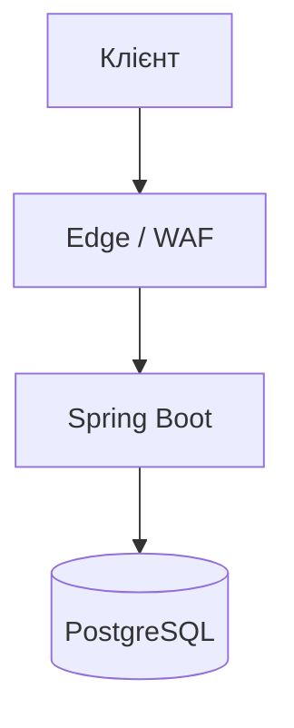

[⬅️](../VaultNote_Atlas.md)

## 📝 TL;DR

**Edge** — це зовнішній шар перед backend, а **WAF (Web Application
Firewall)** — набір правил, який фільтрує HTTP-запити на цьому шарі. Разом вони
можуть відсікати масований IP-трафік до того, як він навантажить Spring Boot.

## Як це працює

Edge/WAF може обмежувати кількість запитів з IP, блокувати очевидних ботів,
застосовувати правила до конкретних endpoint-ів і зупиняти простий flood ще до
backend. Приклади таких сервісів — Cloudflare, AWS WAF або reverse proxy з
відповідними правилами.

## Чим це відрізняється від application rate limiting

Application rate limiting працює всередині Spring Boot. Він потрібен для правил,
які знають бізнес-контекст: ліміт на нормалізований email, password reset або
verification email.

Edge/WAF працює раніше й краще підходить для грубого захисту від масованих
запитів за IP. Це особливо важливо при кількох backend-інстансах, де локальний
in-memory counter кожного JVM не бачить counters інших інстансів.

Для локального запуску VaultNote Edge/WAF не потрібен. Перед публічним
multi-instance deployment потрібні shared atomic storage для application
лімітів і edge/WAF для coarse IP flood protection.
