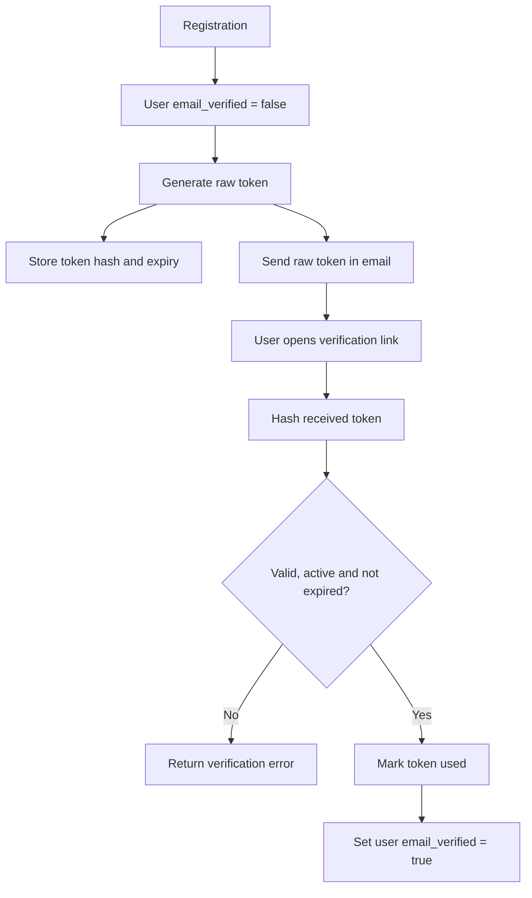

[⬅️](../VaultNote_Atlas.md)

## 📝 TL;DR

`email_verification_tokens` — окрема таблиця для одноразових токенів
підтвердження email. У ній зберігається hash токена, термін дії та стан його
використання, а raw token існує лише в посиланні з листа.

---

## Чому токен — окрема модель

Користувач може декілька разів запросити verification email. Кожна спроба
створює новий токен із власним терміном дії та lifecycle. Якщо зберігати токен
безпосередньо в `users`, модель користувача починає відповідати ще й за
історію та стани тимчасових verification credentials.

Окрема таблиця дозволяє:

- мати кілька спроб підтвердження;
- інвалідувати старі токени під час resend;
- перевіряти expiry та single-use незалежно від user profile;
- додати аудит або cleanup прострочених записів у майбутньому.

## Запропонована структура

```text
email_verification_tokens
├── id              primary key
├── user_id         FK → users.id
├── token_hash      SHA-256 hash, UNIQUE
├── expires_at      момент завершення дії
├── created_at      момент створення
├── used_at         nullable, момент використання
└── invalidated_at  nullable, момент інвалідації
```

Конкретний TTL токена потрібно зафіксувати під час реалізації. `used_at` і
`invalidated_at` моделюють стани timestamp-ами, а не неявними прапорцями або
текстовим статусом.

## Чому зберігається hash

У лист потрапляє тільки випадково згенерований raw token:

```text
https://app.local/verify-email?token=<raw-token>
```

У базі зберігається лише hash. Під час підтвердження API хешує token із
запиту та шукає відповідний запис. Якщо база даних стане доступною
атакеру, raw token не можна буде одразу використати як готове посилання.

Token потрібно генерувати криптографічно випадковим генератором, не логувати
й не зберігати в повному вигляді. Унікальність `token_hash` захищає від
колізій і помилок повторного запису.

## Потік підтвердження



Перевірка має бути атомарною: у межах однієї транзакції потрібно перевірити
токен, позначити його використаним і підтвердити email користувача. Це не
дозволяє використати один token повторно.

## Resend і старі токени

Під час повторного надсилання старі активні токени потрібно інвалідувати, а
потім створювати новий. Тоді посилання з попереднього листа перестає працювати
навіть якщо його термін дії ще не завершився.

Пошук активного токена має враховувати всі умови:

```text
token_hash = hash(request_token)
used_at IS NULL
invalidated_at IS NULL
expires_at > current_time
```

## Trade-off без outbox

На першому етапі verification email надсилається напряму через `MailSender`.
Це простіше, але потрібно явно визначити поведінку при SMTP-помилці:

- якщо відправлення відбувається всередині транзакції, помилка може скасувати
  реєстрацію разом із токеном;
- якщо відправлення відбувається після commit, користувач може бути створений,
  але лист не дійде;
- outbox у майбутньому зберігатиме надійний намір відправити повідомлення та
  дозволить повторні спроби.

Поки outbox не доданий, цю семантику потрібно покрити тестами й не створювати
ілюзію гарантованої доставки.
