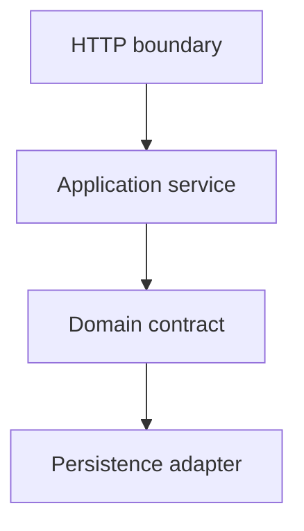

[⬅️](../VaultNote_Atlas.md)

## 📝 TL;DR

Gradle-модуль і Java-пакет — це різні рівні ізоляції. Модулі дають
compile-time enforcement через залежності Gradle, а пакети задають логічні
межі всередині одного application. Для поточного розміру VaultNote достатньо
одного Gradle-проєкту з дисциплінованими пакетними межами.

---

## Поточний baseline

Backend має один Gradle root project. Усередині нього код розділений за
відповідальністю:

```text
com.andrii.vaultnote
├── app/api                 HTTP controllers і DTO
├── app/service             application use cases
├── app/config              Spring configuration
├── app/mapper              DTO ↔ persistence mapping
└── users/infrastructure    User persistence
```

Пакетна межа допомагає зрозуміти ownership, але сама по собі не забороняє
будь-якому коду імпортувати інший пакет. Її дотримання зараз є архітектурною
конвенцією та предметом code review.

## Що додають Gradle-модулі

Окремий Gradle-модуль може мати власні dependencies і public API. Якщо модуль
`notes` не залежить від `users`, Gradle може зробити таку залежність технічно
неможливою або принаймні явно видимою.



Модульне розділення корисне, коли:

- доменні межі вже стабільні;
- команди або lifecycle компонентів відокремлені;
- потрібен сильний контроль залежностей;
- окремі частини мають незалежні build або reuse потреби.

## Вартість передчасного розділення

Порожні або штучні модулі додають build-конфігурацію, dependency wiring,
складніший запуск і більше місць для помилок, не створюючи реальної ізоляції.
Якщо доменні межі ще змінюються, пакетна структура дешевша для еволюції.

Це не означає, що модулі не потрібні назавжди. Пізніше код можна розділити
механічно, якщо ownership і напрямок залежностей стануть достатньо зрозумілими.

## Правило залежностей

Незалежно від фізичної структури залежності мають рухатися до стабільніших
нижчих рівнів. `app` може координувати use cases, але persistence-клас не
повинен залежати від HTTP DTO. Так пакетні межі залишаються корисними навіть
до появи окремих Gradle-модулів.
