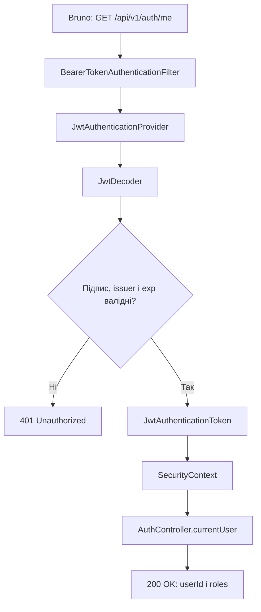

[⬅️](../VaultNote_Atlas.md)

## 📝 TL;DR

JWT не приховує дані — його header і payload можна легко декодувати. Його
сенс у тому, щоб передати claims, підписані backend: сервер перевіряє підпис,
issuer і термін дії, а потім дозволяє або відхиляє запит. У VaultNote цей
ланцюжок починається з access token у Bruno і завершується створенням
`SecurityContext` перед викликом `AuthController`.

## Де це використовується у VaultNote

Основна перевірка доступу виконується endpoint-ом:

```http
GET /api/v1/auth/me
Authorization: Bearer <access-token>
```

Endpoint повертає `userId` і ролі з перевіреного JWT. Він потрібен як простий
access-check: якщо токен валідний, запит отримує `200 OK`; якщо токена немає
або він не проходить перевірку, запит не доходить до controller.

Пов'язані частини застосунку:

- **Створення JWT** — `LoginServiceImpl` і `AccessTokenGenerator`.
- **Підпис** — `JwtEncoder` і `NimbusJwtEncoder` у `JwtConfiguration`.
- **Перевірка JWT** — `JwtDecoder` і `NimbusJwtDecoder` у `JwtConfiguration`.
- **Підключення Bearer authentication** — `SecurityConfig`.
- **Захищений endpoint** — `AuthController` і `CurrentUserResponse`.
- **Перевірка PostgreSQL integration test** — `AuthenticatedUserIntegrationTest`.
- **Ручна перевірка** — Bruno-реквести `Login` і `Current User`.

## Чому JWT можна розкодувати

JWT не є зашифрованим повідомленням. Він має структуру:

```text
header.payload.signature
```

Перші дві частини закодовані Base64URL, тому їх може прочитати будь-хто, хто
має токен. Це очікувана поведінка. У payload не можна зберігати пароль,
refresh token або секретні персональні дані.

Захищається не читабельність payload, а його цілісність і походження. Якщо
хтось змінить `roles` з `USER` на `ADMIN`, наявний підпис більше не відповідатиме
новому payload.

## Що містить JWT

У VaultNote access token має такі claims:

```json
{
  "iss": "vaultnote",
  "sub": "3",
  "iat": 1786366892,
  "exp": 1786626092,
  "roles": ["USER"]
}
```

- `iss` — issuer, який видав токен;
- `sub` — ідентифікатор користувача;
- `iat` — момент створення токена у Unix seconds;
- `exp` — момент завершення дії у Unix seconds;
- `roles` — ролі, які були відомі під час створення токена.

У header додатково вказуються:

- `typ: JWT` — тип credential;
- `alg: HS256` — алгоритм підпису;
- `kid` — ідентифікатор ключа, який не є секретом.

Значення `exp - iat` для local profile дорівнює `259200` секунд, тобто трьом
дням. Для звичайного/default профілю access token має TTL 15 хвилин.

## Як token створюється під час login

1. Bruno надсилає email і password на `POST /api/v1/auth/login`.
2. `LoginServiceImpl` знаходить користувача, перевіряє `emailVerified` і
   password через `PasswordEncoder`.
3. `AccessTokenGenerator` бере `user.id`, ролі, issuer, поточний час і TTL.
4. На основі цих даних створюється `JwtClaimsSet`.
5. `JwtEncoder` передає claims у `NimbusJwtEncoder`.
6. `NimbusJwtEncoder` формує header і payload та підписує їх через HS256.
7. Access token повертається у JSON як `accessToken`.

Одночасно login створює окремий opaque refresh token. Його raw value йде в
`HttpOnly` cookie, а hash зберігається в PostgreSQL. Це інший credential і
інший lifecycle, описаний у нотатці [Refresh token rotation і reuse detection](Refresh-token-rotation-і-reuse-detection.md).

## Як захищається JWT від підробки

У HS256 використовується один секретний ключ для підпису і перевірки. Умовно
підпис обчислюється так:

```text
signature = HMAC-SHA256(
    jwtSecret,
    base64url(header) + "." + base64url(payload)
)
```

Під час login backend має `jwtSecret` і може створити коректний підпис. Під
час access request backend знову обчислює підпис із тим самим secret і порівнює
його з третьою частиною JWT.

Якщо змінити хоча б один символ header або payload, результат HMAC зміниться, і
`JwtDecoder` відхилить токен. Якщо зловмисник отримає сам JWT, він може його
читати, але без secret не може створити інший валідний JWT.

Secret береться з `VAULTNOTE_JWT_SECRET` і має містити щонайменше 32 символи.
Його не можна передавати в онлайн-декодери JWT або зберігати в репозиторії.

## Повний ланцюжок від Bruno до controller



### 1. Bruno формує HTTP-запит

Після натискання `Send` Bruno підставляє `apiUrl` і відправляє header:

```http
Authorization: Bearer eyJ...
```

Для `Current User` потрібен саме access token із поля `access_token` у відповіді
Login. Refresh token із `Set-Cookie` сюди не підходить.

### 2. BearerTokenAuthenticationFilter дістає токен

Spring Security перехоплює запит ще до controller. `BearerTokenAuthenticationFilter`
шукає header `Authorization`, перевіряє префікс `Bearer` із пробілом після нього
і дістає raw JWT.

На цьому етапі токен ще не вважається перевіреним. Filter лише передає його
далі в authentication provider.

### 3. JwtAuthenticationProvider викликає JwtDecoder

`JwtAuthenticationProvider` викликає:

```java
jwtDecoder.decode(rawToken)
```

У нашому застосунку bean `JwtDecoder` — це `NimbusJwtDecoder`, створений у
`JwtConfiguration` із тим самим `SecretKey`, який використовує encoder.

### 4. JwtDecoder розбирає та перевіряє токен

`NimbusJwtDecoder`:

1. розділяє JWT на header, payload і signature;
2. декодує header і payload з Base64URL;
3. перевіряє підпис HS256;
4. перевіряє issuer `vaultnote`;
5. перевіряє часові claims, зокрема `exp`;
6. повертає об'єкт `Jwt`, якщо всі перевірки успішні.

Decoder не розшифровує payload, бо JWT не зашифрований. Він декодує
Base64URL і перевіряє автентичність підпису.

### 5. Створюється authentication

Після успішного decode Spring Security створює
`JwtAuthenticationToken` і позначає request як authenticated. Authentication
зберігається в `SecurityContext` лише на час поточного request.

### 6. Працює authorization

У `SecurityConfig` endpoint не позначений як `permitAll`, тому для нього діє:

```java
.anyRequest().authenticated()
```

Якщо authentication успішна, запит проходить далі. Якщо токен відсутній,
прострочений або має неправильний підпис, controller не викликається.

### 7. Controller отримує перевірений Jwt

Spring інжектить validated token у параметр:

```java
@AuthenticationPrincipal Jwt jwt
```

`AuthController` читає `sub` і `roles`, створює `CurrentUserResponse` і
повертає його клієнту.

Поточний endpoint не робить повторний запит у базу. Він довіряє claims лише
після успішної криптографічної перевірки JWT.

## Що означає STATELESS

У `SecurityConfig` задано:

```java
.sessionManagement(session -> session
    .sessionCreationPolicy(SessionCreationPolicy.STATELESS))
```

Spring Security не створює серверну HTTP-сесію для access authentication. Кожен
запит сам містить Bearer JWT, а `SecurityContext` існує лише протягом цього
запиту.

Це означає:

- backend не зберігає login session у `HttpSession`;
- access authentication не залежить від `JSESSIONID`;
- сервер можна масштабувати без shared session storage;
- перезапуск backend не анулює вже виданий JWT;
- дострокове відкликання access JWT потребує окремого механізму.

`STATELESS` не означає, що вся authentication без стану. У VaultNote це
гібридна модель: **stateless access authentication із stateful refresh session**.

### Які стани існують одночасно

| Стан | Де живе | Lifecycle |
| --- | --- | --- |
| `SecurityContext` | Пам'ять backend request | Тільки поточний HTTP request. |
| Access JWT | Angular memory | До `exp` або повного reload frontend. |
| Refresh session | Hash token-а, family, expiry і `revoked_at` у PostgreSQL; raw token у `HttpOnly` cookie | До rotation, logout або expiry. |
| CSRF state | `XSRF-TOKEN` cookie і `X-XSRF-TOKEN` header | Для підтвердження browser mutation request. |

Тому `POST /login` є state-changing request, хоча він не створює `HttpSession`:

1. backend записує hash нового refresh token-а в PostgreSQL;
2. backend встановлює `HttpOnly` `vaultnote_refresh_token` cookie;
3. frontend отримує access JWT і зберігає його тільки в memory.

Так само `POST /refresh` змінює refresh-token state через rotation, а
`POST /logout` змінює його через revoke і очищення cookie. CSRF захищає саме
ці побічні ефекти, а не наявність або відсутність Spring HTTP session.

Коротка модель для запам'ятовування:

> JWT — самодостатній короткоживучий access credential. Refresh token —
> довгоживуча серверно контрольована refresh session. `SecurityContext` —
> тимчасовий результат перевірки JWT для одного request.

## Ролі та межі поточної реалізації

Claim `roles` перевіряється через `UserRole`, а
`RolesJwtAuthenticationConverter` перетворює значення на Spring authorities
на кшталт `ROLE_USER` і `ROLE_ADMIN` ще до входу в controller. Невідоме або
відсутнє значення ролі відхиляється під час authentication.

Поточний `GET /api/v1/auth/me` перевіряє саме автентифікацію, а не повну
авторизацію. Він також не перевіряє, чи існує user із `sub` у базі. Тому
видалений user теоретично залишатиметься authenticated до завершення терміну
дії JWT.

У поточному authentication slice ще не реалізовані:

- rate limiting та authentication audit events.

## Типові помилки під час ручної перевірки

- **У Bearer передано refresh token.** Access token починається з `eyJ` і має
  три частини, refresh token — opaque random string із cookie.
- **У Bearer додано подвійний префікс.** У змінній Bruno має бути лише raw JWT,
  без `Bearer`; префікс додається header-ом або Auth tab.
- **Використовується стара версія backend.** Після зміни `SecurityConfig`
  backend потрібно перезапустити.
- **Використовується неправильний secret у decoder.** Онлайн-декодер може
  показати `Valid JWT`, але `Invalid Signature`, якщо введено не той secret.
- **JWT протермінований.** Декодування payload ще працює, але перевірка `exp`
  відхилить request.

## Пов'язані нотатки

- [Refresh token rotation і reuse detection](Refresh-token-rotation-і-reuse-detection.md)
- [Інтеграційні тести Spring Boot](Інтеграційні-тести-Spring-Boot.md)
