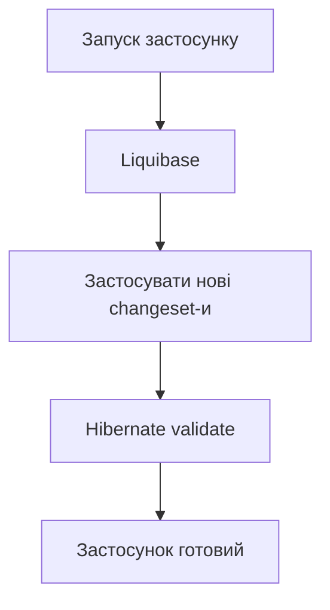

[⬅️](../VaultNote_Atlas.md)

## 📝 TL;DR

Liquibase є джерелом істини для структури бази даних: зміни описуються
послідовними changeset-ами й застосовуються під час запуску. Hibernate не
створює та не змінює схему, а лише перевіряє, що JPA-модель відповідає вже
застосованим міграціям.

---

## Розподіл відповідальності

У системі є два різні завдання:

| Інструмент | Відповідальність |
| --- | --- |
| Liquibase | Створює та змінює таблиці, колонки, індекси й constraints |
| Hibernate | Мапить Java entities на схему та перевіряє її сумісність |

Це розділення не дозволяє випадковій зміні Java-класу непомітно змінити
production-базу даних.

## Як організована міграція

Master changelog підключає окремі файли міграцій. У поточному проєкті SQL
зберігається всередині XML-обгортки Liquibase, а кожен файл містить один
changeset. Наприклад, міграція `001-create-users-table` створює таблицю
`vaultnote.users`.

Liquibase записує виконані changeset-и у службові таблиці
`databasechangelog` та `databasechangeloglock`. Завдяки цьому вже застосовані
зміни не виконуються повторно.

## Правило forward-only

Після застосування changeset не редагують і не видаляють. Якщо потрібно
змінити схему, додають наступний changeset, наприклад `002-add-...`.

Це зберігає історію переходів між версіями схеми та дозволяє відтворити
структуру бази в новому середовищі.

## Чому Hibernate не повинен створювати схему

Режими `create`, `update` або `create-drop` зручні для коротких демо, але
небезпечні для контрольованої еволюції production-схеми. Режим `validate`
робить невідповідність видимою під час запуску, не змінюючи дані.

Отже, зміна `UserEntity` сама по собі не є міграцією. Спочатку потрібно
описати перехід схеми в Liquibase, а потім оновити entity та перевірки.
