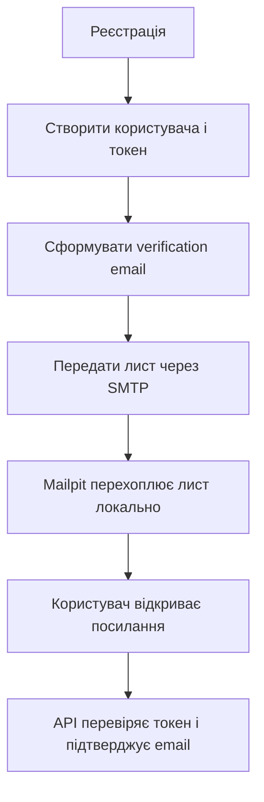

[⬅️](../VaultNote_Atlas.md)

## 📝 TL;DR

Mail — це окрема інфраструктурна межа, через яку застосунок надсилає
повідомлення, наприклад лист із посиланням для підтвердження email. Локально
лист перехоплює Mailpit, а в production його має приймати справжній SMTP
провайдер. На першому етапі ми не зберігаємо заплановані листи в outbox, щоб
не ускладнювати базовий сценарій реєстрації.

---

## Що входить у Mail

Mail не повинен знати правила реєстрації користувача. Його відповідальність —
сформувати та передати повідомлення через узгоджений порт, наприклад:

```text
Use case реєстрації
        ↓
MailSender — прикладний порт
        ↓
SMTP-адаптер
        ↓
Mailpit локально або SMTP-провайдер у production
```

Саме use case вирішує, коли потрібно надіслати лист і які дані передати в
шаблон. Mail відповідає за адресу отримувача, тему, текст або HTML-шаблон і
SMTP-конфігурацію, але не за створення користувача чи перевірку токена.

## Як це пов'язано з верифікацією email

Спрощений потік виглядає так:



Токен верифікації — це частина authentication-домена. Mail лише доставляє
посилання, яке містить цей токен, і не має самостійно вважати адресу
підтвердженою.

## Що означає «поки без outbox»

Outbox — це таблиця в тій самій базі даних, куди разом із бізнес-зміною
записується подія або команда на відправлення листа. Окремий воркер потім
забирає такі записи, надсилає повідомлення, повторює невдалі спроби та
позначає результат.

Без outbox застосунок після виконання сценарію реєстрації викликає Mail
безпосередньо. У нас немає окремого гарантованого запису «цей лист треба
відправити» і немає вбудованого механізму повторних спроб.

| Варіант | Перевага | Недолік |
| --- | --- | --- |
| Прямий виклик Mail | Простий код і швидка реалізація | Збій SMTP може залишити користувача без листа |
| Outbox | Бізнес-зміна і намір відправити лист зберігаються надійно | Потрібні таблиця, воркер, статуси та retry-політика |

На етапі навчального проєкту прямого виклику достатньо. Mailpit дозволяє
перевіряти сформовані листи локально, не надсилаючи їх реальним адресатам.

## Коли outbox стане доречним

До нього варто повернутися, коли доставка email стане критичною для бізнесу
або з'являться кілька типів повідомлень і фонові задачі. Тоді можна буде
додати:

- таблицю повідомлень зі статусами `PENDING`, `SENT`, `FAILED`;
- окремий dispatcher або scheduled worker;
- обмежені повторні спроби з backoff;
- ідемпотентність, щоб один лист не надсилався повторно без потреби;
- спостережуваність: логи, метрики та dead-letter сценарій.

Поки що це свідоме спрощення, а не відмова від outbox як майбутнього
архітектурного рішення.
