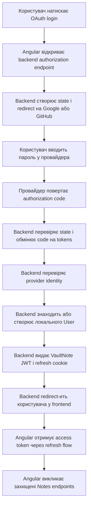

[⬅️](../VaultNote_Atlas.md)

## 📝 TL;DR

OAuth2 — це спосіб делегувати частину роботи з доступом зовнішньому провайдеру,
наприклад Google або GitHub. OIDC додає до OAuth2 відповідь на питання «хто ця
людина?», тому для Google login потрібен OAuth2 + OIDC. GitHub OAuth App має
окремий варіант: після OAuth2 backend отримує профіль через GitHub API, без
OIDC `id_token`.

У VaultNote провайдер підтверджуватиме особу, але після успішного входу backend
все одно видаватиме власні JWT і refresh token. Так зберігаються наші ролі,
ownership і вже реалізований lifecycle токенів.

## Що ми хочемо вирішити

Зараз користувач VaultNote входить за email і password. Це означає, що VaultNote
сам:

- приймає пароль;
- перевіряє його через `PasswordEncoder`;
- вирішує, чи підтверджений email;
- створює власний access JWT;
- створює refresh token і зберігає його hash у базі.

OAuth2/OIDC дає альтернативний шлях: пароль вводиться на сторінці Google або
GitHub, а VaultNote отримує підтверджену інформацію про користувача.

VaultNote не бачить і не зберігає пароль від Google чи GitHub.

## OAuth2 і OIDC — це не одне й те саме

### OAuth2

OAuth2 — це framework для делегованої авторизації. Він відповідає на питання:

> Чи дозволив користувач цьому застосунку отримати доступ до певного ресурсу?

Наприклад, застосунок може отримати дозвіл читати профіль або email користувача.

Сам OAuth2 не є повноцінним стандартом login. Він не гарантує універсальний
формат інформації про особу.

### OIDC

OIDC — це identity layer поверх OAuth2. Він додає стандартизований `id_token`,
який описує, хто саме пройшов автентифікацію.

У `id_token` можуть бути claims:

- `iss` — хто видав token;
- `sub` — стабільний ідентифікатор користувача у провайдера;
- `aud` — для якого застосунку виданий token;
- `exp` — коли token перестає діяти;
- `email` — email користувача;
- `email_verified` — чи підтверджений email.

Тому для кнопки «Увійти через Google» нам потрібен не просто OAuth2, а
OAuth2/OIDC.

## Основні учасники flow

- **Користувач** — людина, яка хоче увійти.
- **Angular frontend** — показує кнопку login і запускає redirect.
- **VaultNote backend** — наш OAuth client і головний orchestrator flow.
- **Google** — Authorization Server і OIDC Identity Provider.
- **GitHub** — OAuth Authorization Server, який повертає identity через API.
- **VaultNote API** — Resource Server, який після login перевіряє вже наші JWT.

У цьому flow VaultNote backend є OAuth client щодо Google або GitHub, але для
наших Notes він залишається Resource Server.

## Повний flow простою мовою



### 1. Користувач натискає кнопку

На login page Angular будуть кнопки:

```text
Continue with Google
Continue with GitHub
```

Клік не повинен робити звичайний API-запит через `HttpClient`. Браузер має
перейти на backend authorization endpoint, щоб пройти redirect flow:

```http
GET /oauth2/authorization/google
```

Для першої реалізації frontend потрібна лише login page і callback route. Окрему
форму для пароля Google або GitHub ми не створюємо — її показує сам провайдер.

### 2. Backend готує authorization request

Backend генерує запит до провайдера. У ньому є:

- `client_id` — ідентифікатор нашого застосунку у провайдера;
- `redirect_uri` — адреса, куди провайдер поверне користувача;
- `scope` — які дані потрібні, наприклад `openid email profile`;
- `state` — випадкове значення для захисту OAuth flow;
- `code_challenge` — частина PKCE-захисту.

`client_secret` ніколи не повинен потрапляти в Angular або браузерний код. Він
зберігається тільки на backend.

### 3. Провайдер автентифікує користувача

Користувач опиняється на сторінці Google або GitHub. Провайдер сам перевіряє:

- пароль;
- MFA, якщо воно налаштоване;
- consent, якщо застосунок просить нові дозволи.

VaultNote не бере участі у введенні цього пароля.

### 4. Провайдер повертає authorization code

Після успішного login провайдер редиректить браузер на callback backend:

```http
GET /login/oauth2/code/google?code=...&state=...
```

`code` — це не access token і не довгоживучий credential. Це короткоживучий
одноразовий код, який backend має обміняти через захищений server-to-server
запит.

### 5. Backend перевіряє state і обмінює code

Backend перевіряє, що:

- `state` збігається з тим, який був створений на початку flow;
- callback прийшов на очікуваний `redirect_uri`;
- authorization code ще не використаний і не протермінований.

Після цього backend звертається до token endpoint провайдера і передає:

- `client_id`;
- `client_secret`;
- authorization `code`;
- `redirect_uri`;
- PKCE `code_verifier`, якщо PKCE використовується.

Провайдер повертає tokens для backend. Їх не потрібно передавати в Angular.

### 6. Backend перевіряє identity провайдера

Backend перевіряє відповідь конкретного провайдера:

- для Google — підпис `id_token`, `iss`, `aud`, `exp`, `sub` і потрібні claims;
- для GitHub — валідність OAuth flow, access token і профіль через `GET /user`;
- для GitHub email за потреби — через `GET /user/emails` зі scope `user:email`.

Нам не можна просто повірити email, який прийшов у довільному JSON. Важливо
перевірити, що він прийшов у валідному OIDC response від очікуваного провайдера.

### 7. Backend знаходить або створює локального User

Зовнішній `sub` не варто використовувати як наш внутрішній `userId`.

Ми створюємо окремий зв'язок приблизно такого змісту:

```text
provider = google
provider_subject = 123456789
user_id = 42
```

Тоді зміна email у провайдера не ламає ідентичність користувача: стабільним
ключем є пара `provider + provider_subject`.

Можливі варіанти:

- якщо identity вже пов'язана з User — продовжити login;
- якщо identity нова, але verified email збігається з локальним User — не
  прив'язувати автоматично без чітко визначеного правила;
- якщо identity нова — створити локального User і надати роль `USER`.

Автоматичне злиття акаунтів тільки за email може бути небезпечним, тому правила
account linking треба визначити окремо.

### 8. VaultNote видає власні tokens

Провайдер підтвердив особу, але Notes API не повинен залежати від Google або
GitHub на кожному запиті.

Після успішного OAuth login VaultNote використовує вже готовий механізм:

- `AccessTokenGenerator` створює наш access JWT;
- у JWT потрапляють наші `sub`, `iss`, `exp` і `roles`;
- refresh token генерується окремо;
- у cookie потрапляє raw refresh token;
- у PostgreSQL зберігається тільки hash refresh token-а.

Отже, для захищеного endpoint-а `/api/v1/notes` не має значення, як саме
користувач увійшов: через password або через Google. Backend бачить однаковий
VaultNote access JWT.

### 9. Backend повертає користувача у frontend

Після видачі наших tokens backend має повернути браузер у Angular.

Access JWT не можна передавати в URL:

```text
https://frontend.example.com/callback?access_token=eyJ...
```

URL може потрапити в history, access logs, browser extensions або заголовок
`Referer`.

Безпечніший запланований flow для VaultNote:

1. backend встановлює `HttpOnly` refresh cookie;
2. backend redirect-ить користувача на Angular callback route;
3. Angular отримує CSRF token;
4. Angular викликає наш `/api/v1/auth/refresh`;
5. Angular тримає access JWT тільки в memory.

## Навіщо потрібен state

`state` захищає OAuth login від ситуації, коли зловмисник підсовує нашому
callback чужий authorization response.

Умовно:

1. VaultNote створює випадковий `state = abc123`;
2. зберігає його на короткий час у захищеному cookie;
3. відправляє `state=abc123` провайдеру;
4. отримує `state` назад у callback;
5. порівнює значення.

Якщо значення не збігаються, flow треба відхилити.

Цей state — технічний стан одного OAuth handshake, а не login session. Після
завершення flow він більше не потрібен.

## Чим OAuth token відрізняється від VaultNote JWT

У flow можуть існувати різні tokens:

- **authorization code** — короткоживучий одноразовий код для обміну;
- **provider access token** — token для API Google або GitHub;
- **OIDC ID token** — підтверджена інформація про identity;
- **VaultNote access JWT** — token для наших Notes endpoints;
- **VaultNote refresh token** — token для отримання нового VaultNote access JWT.

Це різні tokens із різним призначенням. Provider access token не можна просто
підставити в:

```http
Authorization: Bearer <token>
```

для VaultNote API.

## Чи потрібен frontend

Для backend-реалізації не потрібен повний Angular application. Flow можна
перевірити браузером через provider-hosted login page і тимчасовий callback.

Для нормального користувацького сценарію потрібні:

- кнопки provider login на існуючій login page;
- callback route;
- виклик `/csrf` і `/api/v1/auth/refresh` після redirect;
- збереження access JWT тільки в memory;
- redirect на Notes page після завершення login.

У плані VaultNote це розділено так:

- **Phase 4** — мінімальна Angular login page;
- **Phase 5** — OAuth2/OIDC backend flow і кнопки provider-а;
- **Phase 6** — решта Angular application.

## Як це буде виглядати у VaultNote

Зараз OAuth2/OIDC у VaultNote ще не реалізований. Він запланований на Phase 5.

Архітектурне рішення зафіксоване як proposed ADR 014 у
[плані проєкту](../../docs/project-plan.md).

Плановані частини:

- Spring Security OAuth2 Client на backend;
- provider configuration для Google;
- окремий OAuth2/API identity flow для GitHub, якщо його додамо;
- callback і перевірка Google OIDC identity;
- зв'язок provider identity з локальним User;
- повторне використання наших JWT і refresh-token flows;
- Angular buttons і callback route;
- provider-mocked integration tests.

## Чого не треба робити

- не зберігати provider password у VaultNote;
- не довіряти неперевіреному email;
- не робити `USER` або `ADMIN` із довільного provider claim без власних правил;
- не використовувати provider access token як VaultNote access JWT;
- не передавати access або refresh token у query parameters;
- не логувати `authorization code`, provider tokens або наші refresh tokens;
- не вважати OAuth2 заміною backend authorization.

OAuth підтверджує identity, але право читати або змінювати конкретний Note все
одно визначається нашими backend service rules і `CurrentUserProvider`.

## Пов'язані нотатки

- [OAuth-провайдери: Google, Apple, Facebook і GitHub](OAuth-провайдери-Google-Apple-Facebook.md)
- [JWT-аутентифікація і перевірка доступу](JWT-аутентифікація-і-перевірка-доступу.md)
- [CSRF та CORS](CSRF-та-CORS.md)
- [Refresh token rotation і reuse detection](Refresh-token-rotation-і-reuse-detection.md)
- [@PreAuthorize на service-інтерфейсі](PreAuthorize-на-service-інтерфейсі.md)
