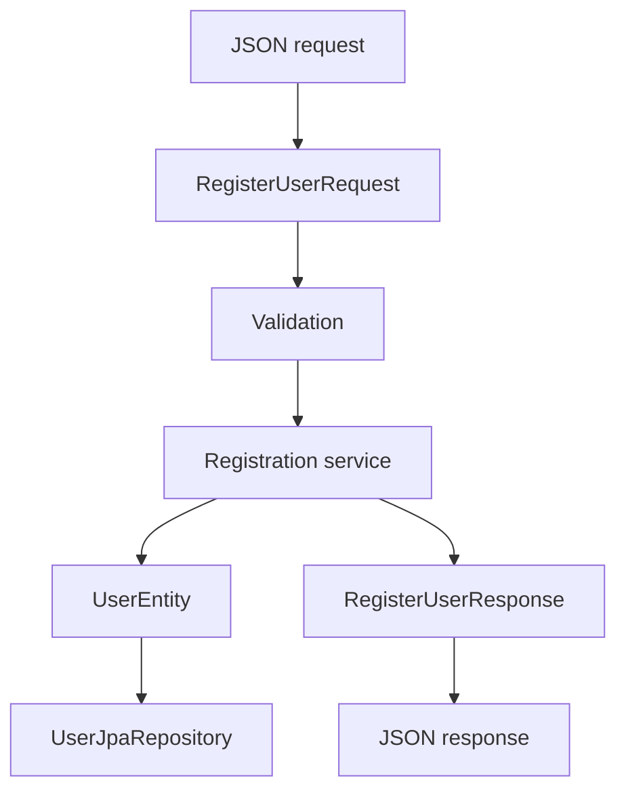

[⬅️](../VaultNote_Atlas.md)

## 📝 TL;DR

REST API має працювати з явними request і response DTO, а не напряму з JPA
entities. OpenAPI описує цей публічний контракт, тоді як entity та repository
залишаються деталями persistence.

---

## Межа між HTTP і persistence

У поточному registration API:

- `RegistrationController` приймає `RegisterUserRequest`;
- service створює `UserEntity` через mapper і repository;
- controller повертає `RegisterUserResponse` з `userId`;
- endpoint має `POST /api/v1/auth/registrations` і повертає `201 Created`.

## Чому entity не є DTO

`UserEntity` містить поля, які не повинні бути частиною зовнішнього API:

- `passwordHash` — чутливе внутрішнє значення;
- `emailVerified` — внутрішній стан account lifecycle;
- `createdAt` та `updatedAt` — persistence metadata;
- JPA-анотації та спосіб зберігання.

Якщо повертати entity напряму, зміна схеми або persistence-моделі може
випадково змінити API. DTO дозволяє контролювати, які поля клієнт надсилає і
які отримує.

## Роль OpenAPI

Springdoc і OpenAPI-анотації описують операцію, статуси, response та DTO
схеми. Це має бути джерелом істини для публічного API-контракту:

1. Controller визначає HTTP boundary.
2. DTO визначають JSON shape.
3. Validation визначає допустимий input.
4. OpenAPI робить цей контракт видимим для людей, Swagger UI та майбутнього
   client generation.

У поточному request DTO `snake_case` задається явно через
`@JsonNaming(PropertyNamingStrategies.SnakeCaseStrategy.class)`. Це не означає,
що всі DTO автоматично мають глобальну naming strategy: глобальне правило
потрібно вводити окремим свідомим рішенням.

## Практичне правило

Мапінг між DTO та entity має бути явним і тестованим. API-модель може
розвиватися незалежно від таблиць, а persistence-модель — змінюватися без
несанкціонованої зміни публічного контракту.
