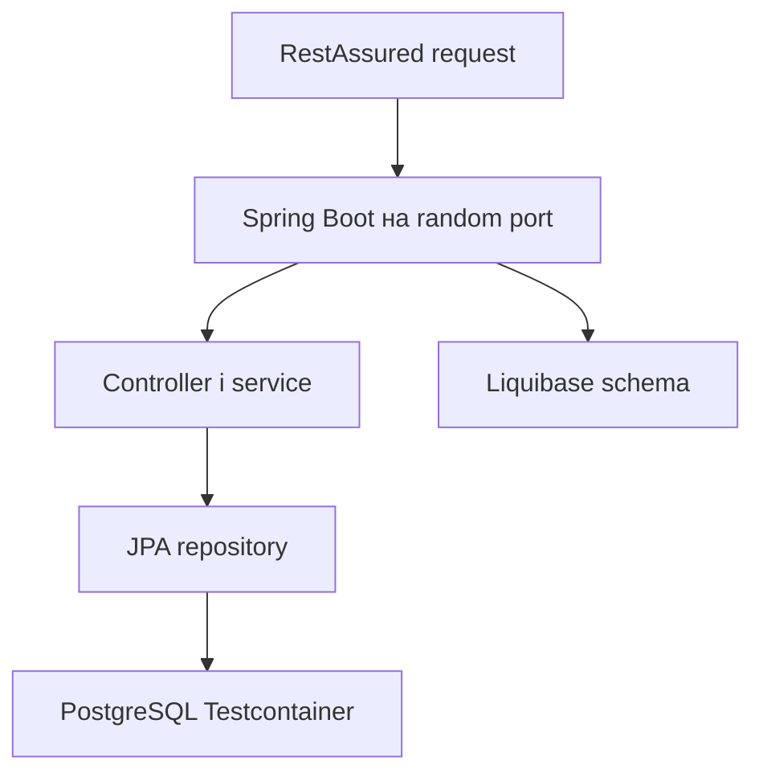

[⬅️](../VaultNote_Atlas.md)

## 📝 TL;DR

Інтеграційний тест перевіряє не окремий метод, а взаємодію HTTP API,
Spring-контексту, Liquibase, JPA та реальної PostgreSQL. У проєкті для цього
використовуються `@SpringBootTest` на випадковому порту, Testcontainers,
RestAssured і DBRider.

---

## Що саме перевіряє тест

Такий тест може виявити проблеми, яких не видно в unit test:

- неправильний component scanning або wiring;
- помилку JSON-мепінгу DTO;
- невідповідність entity і схеми;
- помилку Liquibase-міграції;
- неправильні database constraints або transaction boundaries.

## Ролі інструментів

| Інструмент | Роль |
| --- | --- |
| `@SpringBootTest` | Піднімає повний application context |
| Testcontainers | Запускає ізольований PostgreSQL для тесту |
| RestAssured | Виконує реальні HTTP-запити |
| DBRider | Завантажує datasets і очищає тестові дані |
| AssertJ | Перевіряє response та стан бази |

Базовий клас запускає контейнер PostgreSQL і передає його JDBC-параметри в
Spring через `@DynamicPropertySource`. Тест реєстрації після HTTP-виклику
додатково читає `UserEntity` через repository, щоб перевірити фактичний стан
даних.

## Хороший сценарій інтеграційного тесту

1. Підготувати dataset або чистий стан бази.
2. Створити request через реальний DTO builder.
3. Виконати HTTP-запит через RestAssured.
4. Десеріалізувати response у відповідний DTO.
5. Перевірити HTTP-контракт.
6. Перевірити persistence-результат через repository або SQL-перевірку.

Unit tests залишаються корисними для ізольованої policy чи mapper-логіки.
Інтеграційні тести потрібні там, де цінність становить саме зв'язок між
кількома шарами системи.

## На що звертати увагу

Інтеграційний тест не повинен покладатися на спільну локальну базу або дані з
іншого тесту. Контейнер і dataset мають робити сценарій відтворюваним, а
перевірки — описувати зовнішню поведінку й важливі наслідки в persistence.
