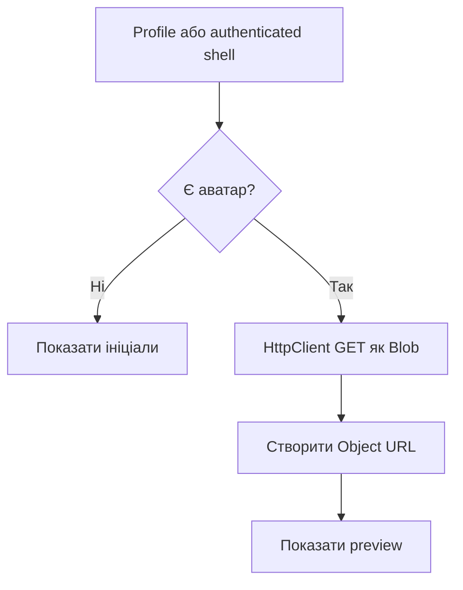
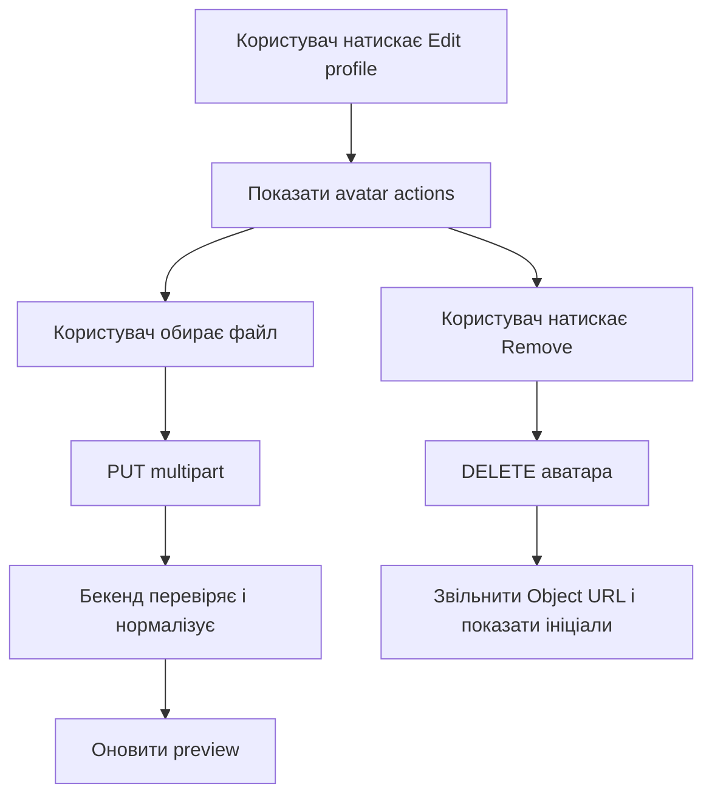

[⬅️](../VaultNote_Atlas.md)

## 📝 TL;DR

Аватар буде окремим захищеним ресурсом автентифікованого користувача. Файл не
зберігатиметься в `users` або в `UserEntity`: на першому етапі нормалізовані
байти зберігатимуться в окремій PostgreSQL-таблиці `user_avatars`, а пізніше
сховище можна буде замінити на об'єктне сховище через окрему абстракцію.

Клієнт може завантажувати, замінювати, отримувати й видаляти аватар. Бекенд
не довірятиме імені файлу або MIME-типу від браузера, а декодуватиме зображення,
перевірятиме його розмір і формат, застосовуватиме орієнтацію, видалятиме
метадані та зберігатиме контрольовано нормалізований результат.

## Поточний статус

Реалізацію завершено для поточного PostgreSQL-backed MVP:

- [x] Backend endpoint-и upload/replacement, retrieval і removal.
- [x] Перевірка, декодування та нормалізація зображень до `256×256` JPEG.
- [x] Окреме зберігання в `user_avatars` без поля аватара в `UserEntity`.
- [x] Angular API/state layer із Blob preview, Object URL cleanup і fallback на
  ініціали.
- [x] Preview у authenticated shell та Profile screen.
- [x] OpenAPI contract і generated Angular client оновлені після запуску
  backend.
- [x] Frontend і backend тести проходять.

## Мета

Потрібно додати до захищеного профілю такі можливості:

- завантажити аватар, якщо його ще немає;
- замінити існуючий аватар;
- отримати аватар для меню облікового запису та екрана Profile;
- видалити аватар і повернутися до запасного варіанта з ініціалами.

Endpoint-и працюватимуть тільки з аватаром поточного користувача. В URL не буде
`userId`, тому клієнт не зможе запросити аватар іншого користувача, просто
підставивши чужий ідентифікатор.

## API бекенду

| Операція | Endpoint | Результат |
| --- | --- | --- |
| Завантаження або заміна | `PUT /api/v1/users/me/avatar` | Нормалізована відповідь із метаданими |
| Отримання | `GET /api/v1/users/me/avatar` | Байти canonical JPEG з `Content-Type: image/jpeg` |
| Видалення | `DELETE /api/v1/users/me/avatar` | `204 No Content` |

`PUT` прийматиме `multipart/form-data` з частиною `file`. Він буде операцією
upsert:
нова версія спочатку повністю перевіряється та нормалізується, і лише після
цього замінює попередню. Якщо файл некоректний, існуючий аватар не змінюється.

### Межа відповідальності під час завантаження

Для `PUT` контролер залишається тонким HTTP-адаптером: він приймає
`MultipartFile` і передає його далі. Читання байтів та перетворення помилки
`IOException` у `AvatarValidationException` виконує окремий
`MultipartAvatarUploadReader`.

`UserService` не залежить від Spring-типу `MultipartFile` і приймає звичайний
`byte[]`. Завдяки цьому сервіс не прив'язаний до HTTP-механізму завантаження, а
нормалізація, перевірка, заміна та збереження аватара залишаються в сервісному
шарі. Для поточного обмеження 2 MiB окремий application-level DTO для upload
не потрібен: адаптеру достатньо повернути байти.

`GET` повертає, наприклад, `image/jpeg`, `Content-Length` і захисний header
`X-Content-Type-Options: nosniff`. `DELETE` можна зробити ідемпотентним: якщо
аватар уже відсутній, endpoint все одно повертає `204`.

У поточному MVP `UserProfileDto` не містить байтів, шляху або окремої ознаки
аватара. Фронтенд отримує preview через окремий authenticated GET endpoint і
сприймає `404` як відсутній аватар. Версію або ознаку наявності можна додати
пізніше, якщо це стане потрібним для кешування чи зменшення кількості запитів.

## Окреме зберігання

У `UserEntity` не буде поля `avatar` і не буде eager `@OneToOne` зв'язку, який
міг би випадково підтягувати великі байти разом із профілем. Будуть окремі:

- `UserAvatarEntity`;
- `UserAvatarJpaRepository`;
- сервіс аватара та mapper для метаданих.

Початкова PostgreSQL-схема може мати один запис на користувача:

```sql
CREATE TABLE vaultnote.user_avatars (
    user_id BIGINT PRIMARY KEY,
    content BYTEA NOT NULL,
    byte_size INTEGER NOT NULL,
    created_at TIMESTAMP WITH TIME ZONE NOT NULL,
    updated_at TIMESTAMP WITH TIME ZONE NOT NULL,
    CONSTRAINT fk_user_avatars_user
        FOREIGN KEY (user_id) REFERENCES vaultnote.users (id) ON DELETE CASCADE
);
```

Це зберігає аватар окремо від рядка користувача і не додає для локального
запуску нового Docker-сервісу. Коли з'являться більші файли або кілька
екземплярів застосунку, сховище аватарів можна буде перенести до S3-сумісного
об'єктного сховища, залишивши ту саму межу сервісу й API.

## Перевірка та нормалізація зображення

Обмеження мають бути налаштованими, а не захованими лише у фронтенді. Як
початкові значення можна використати:

- максимальний розмір завантаження — 2 MiB;
- максимальні розкодовані розміри — 2048 × 2048;
- додатковий ліміт загальної кількості пікселів;
- точний нормалізований розмір — `256×256`;
- мінімальний вхідний розмір — `64×64`;
- контрольована якість JPEG — приблизно `0.85`.

Алгоритм обробки:

1. Spring multipart layer обмежує розмір HTTP-завантаження.
2. Сервіс додатково перевіряє фактичну кількість байтів.
3. Бекенд визначає формат за вмістом, а не за filename чи MIME-типом, наданим
   клієнтом.
4. Зображення повністю декодується спеціалізованим декодером для JPEG, PNG і
   WebP.
5. Пошкоджені файли, SVG, GIF, інші формати, надмірні розміри та файли з
   небезпечно великою кількістю пікселів відхиляються. Файли менші за `64×64`
   також відхиляються через низьку якість.
6. Застосовується EXIF orientation, після чого зображення збільшується або
   зменшується до точного квадрата `256×256`.
7. Результат перекодовується в єдиний серверний формат JPEG.
8. Новий буфер зображення не переносить EXIF та інші вхідні метадані.
9. У таблицю записується тільки нормалізований результат і його метадані.

### Як саме масштабуємо зображення

Масштабування працює за принципом `cover`: зображення заповнює весь квадрат
`256×256`, пропорції не спотворюються, а зайві частини по довшій стороні
обрізаються по центру.

Алгоритм такий:

1. Після декодування і застосування EXIF orientation визначаємо ширину та
   висоту зображення.
2. Обчислюємо коефіцієнт
   `256 / min(ширина, висота)`. Тобто коротша сторона після масштабування
   стає рівно `256` пікселів.
3. Масштабуємо довшу сторону з тим самим коефіцієнтом, використовуючи
   bicubic interpolation.
4. Розміщуємо отримане зображення по центру полотна `256×256`. Частина, яка
   виходить за межі полотна, автоматично обрізається.
5. Створюємо RGB-зображення з білим фоном і перекодовуємо результат у JPEG.
   Тому прозорі області PNG стають білими, а EXIF та інші вхідні metadata не
   потрапляють у збережений файл.

Приклади:

| Вхідний розмір | Після масштабування | Що відбувається |
| --- | --- | --- |
| `512×512` | `256×256` | Зображення просто зменшується. |
| `400×200` | `512×256` | По `128` пікселів обрізається зліва і справа. |
| `100×300` | `256×768` | По `256` пікселів обрізається зверху і знизу. |
| `100×100` | `256×256` | Маленьке, але допустиме зображення збільшується. |

Файли, у яких будь-яка сторона менша за мінімальні `64` пікселі, відхиляються
до масштабування. Отже, сервер не збільшує надто маленькі зображення, але
допускає вхідні аватари від `64×64` до налаштованих максимальних розмірів.

Фронтенд може мати `accept="image/jpeg,image/png,image/webp"` та ранню перевірку
розміру для зручності користувача, але остаточним джерелом безпеки залишається
бекенд.

## Security і HTTP поведінка

- Усі три endpoint-и захищені автентифікацією і працюють через
  `CurrentUserProvider`.
- `PUT` і `DELETE` проходять звичайний CSRF flow: `CsrfService` отримує cookie,
  а interceptor додає `X-XSRF-TOKEN`.
- `GET` не потребує CSRF, але потребує Bearer access token.
- Ключ сховища або шлях до файлу не приходить від клієнта і не повертається в
  API.
- Зображення віддається як inline image з фіксованим `Content-Type: image/jpeg`,
  а не як довільний файл із початковою назвою.
- При невдалій обробці старий аватар залишається чинним.
- Об'єкт у PostgreSQL видаляється разом із user через foreign key cascade.

## Frontend flow

Звичайний `` не підходить: access token
додається Angular HTTP interceptor-ом, а не браузером до довільного запиту
`img`.

Тому фронтенд завантажує аватар через `HttpClient` як `Blob`, створює
тимчасовий `Object URL` і передає його в меню облікового запису та на
екран Profile. Старий URL потрібно звільняти через `URL.revokeObjectURL()` після
заміни або видалення, щоб не накопичувати Blob у пам'яті.

Реалізовано окремі `AvatarApiService` і `AvatarStateService`:

- `load()` — завантажити Blob або повернути запасний варіант з ініціалами на
  `404`;
- `upload(file)` — відправити FormData і перезавантажити попередній
  перегляд;
- `remove()` — видалити ресурс і очистити Object URL;
- спільний signal/state для authenticated shell і екрана Profile.

`AvatarApiService` використовує Angular `HttpClient`, щоб автоматично
отримувати Bearer token і CSRF header через наявні interceptors. Generated
OpenAPI client також оновлений і містить avatar endpoint-и, але його fetch-based
клієнт не підміняє Angular auth/CSRF flow.

У режимі перегляду Profile показує лише поточний avatar або ініціали. Кнопки
`Upload`, `Replace` і `Remove` стають доступними тільки після `Edit profile`.
Операції з аватаром виконуються одразу після успішної відповіді backend;
`Cancel` скасовує лише незбережену зміну `displayName`.

Послідовність взаємодії:

### Отримання і відображення



### Upload, replacement і removal



## Тести

### Модульні тести бекенду

- `MultipartAvatarUploadReader` повертає байти multipart-файлу та коректно
  перетворює помилку читання у `AvatarValidationException`;
- валідні JPEG, PNG і WebP декодуються;
- fake extension або підроблений MIME-тип не обходять перевірку;
- відхиляються SVG, GIF, пошкоджені, надто великі та надмірно розмірні файли;
- перевіряється застосування нормалізації та відсутність metadata у результаті;
- помилка нового upload не змінює старий avatar;
- заміна й видалення працюють тільки для поточного користувача.

### Інтеграційні тести бекенду

Через Testcontainers і PostgreSQL перевіряються upload, replacement, retrieval,
removal, `401 Unauthorized`, відсутність аватара (`404`) та те, що рядок профілю
не містить байтів зображення.

### Тести фронтенду

- `AvatarApiService` перевіряє Blob GET, multipart PUT і CSRF-protected DELETE;
- `AvatarStateService` кешує preview, обробляє `404`, оновлює Object URL і
  звільняє попередній URL;
- без аватара показуються ініціали;
- upload і replacement оновлюють preview;
- видалення повертає ініціали;
- avatar actions приховані поза режимом `Edit profile`;
- відображаються стани завантаження та помилки.

Після запуску backend OpenAPI було перегенеровано: generated client містить
`getCurrentAvatar`, `uploadCurrentAvatar`, `deleteCurrentAvatar` і
`UserAvatarDto`.

## Порядок реалізації

1. [x] Додати Liquibase changeset і окрему persistence-модель avatar.
2. [x] Реалізувати декодер, validator і normalizer з конфігурованими лімітами.
3. [x] Додати use cases сервісу та authenticated controller endpoint-и.
4. [x] Оновити OpenAPI, згенеровані типи та Angular API/state service.
5. [x] Додати upload, replacement, retrieval, removal і fallback на ініціали
   до Profile та authenticated shell.
6. [x] Запустити модульні, інтеграційні й frontend-тести та перевірити UI
   локально.

## Пов'язані нотатки

- [Auth feature Angular frontend](Angular-auth-feature.md)
- [OpenAPI, DTO та межі REST](OpenAPI-DTO-та-межі-REST.md)
- [CSRF та CORS](CSRF-та-CORS.md)
- [Інтеграційні тести Spring Boot](Інтеграційні-тести-Spring-Boot.md)
