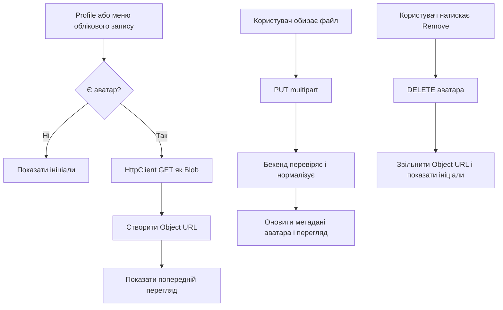

[⬅️](../VaultNote_Atlas.md)

## 📝 TL;DR

Аватар буде окремим захищеним ресурсом автентифікованого користувача. Файл не
зберігатиметься в `users` або в `UserEntity`: на першому етапі нормалізовані
байти зберігатимуться в окремій PostgreSQL-таблиці `user_avatars`, а пізніше
сховище можна буде замінити на об'єктне сховище через окрему абстракцію.

Клієнт зможе завантажувати, замінювати, отримувати й видаляти аватар. Бекенд
не довірятиме імені файлу або MIME-типу від браузера, а декодуватиме зображення,
перевірятиме його розмір і формат, застосовуватиме орієнтацію, видалятиме
метадані та зберігатиме контрольовано нормалізований результат.

## Мета

Потрібно додати до захищеного профілю такі можливості:

- завантажити аватар, якщо його ще немає;
- замінити існуючий аватар;
- отримати аватар для меню облікового запису та екрана Profile;
- видалити аватар і повернутися до запасного варіанта з ініціалами.

Endpoint-и працюватимуть тільки з аватаром поточного користувача. В URL не буде
`userId`, тому клієнт не зможе запросити аватар іншого користувача, просто
підставивши чужий ідентифікатор.

## API бекенду

| Операція | Endpoint | Результат |
| --- | --- | --- |
| Завантаження або заміна | `PUT /api/v1/users/me/avatar` | Нормалізована відповідь із метаданими |
| Отримання | `GET /api/v1/users/me/avatar` | Байти canonical JPEG з `Content-Type: image/jpeg` |
| Видалення | `DELETE /api/v1/users/me/avatar` | `204 No Content` |

`PUT` прийматиме `multipart/form-data` з частиною `file`. Він буде операцією
upsert:
нова версія спочатку повністю перевіряється та нормалізується, і лише після
цього замінює попередню. Якщо файл некоректний, існуючий аватар не змінюється.

### Межа відповідальності під час завантаження

Для `PUT` контролер залишається тонким HTTP-адаптером: він приймає
`MultipartFile` і передає його далі. Читання байтів та перетворення помилки
`IOException` у `AvatarValidationException` виконує окремий
`MultipartAvatarUploadReader`.

`UserService` не залежить від Spring-типу `MultipartFile` і приймає звичайний
`byte[]`. Завдяки цьому сервіс не прив'язаний до HTTP-механізму завантаження, а
нормалізація, перевірка, заміна та збереження аватара залишаються в сервісному
шарі. Для поточного обмеження 2 MiB окремий application-level DTO для upload
не потрібен: адаптеру достатньо повернути байти.

`GET` повертає, наприклад, `image/jpeg`, `Content-Length` і захисний header
`X-Content-Type-Options: nosniff`. `DELETE` можна зробити ідемпотентним: якщо
аватар уже відсутній, endpoint все одно повертає `204`.

У `UserProfileDto` варто додати лише ознаку наявності або версію аватара, а не
внутрішній шлях до сховища. Версія допоможе фронтенду зрозуміти, що старий
попередній перегляд потрібно оновити.

## Окреме зберігання

У `UserEntity` не буде поля `avatar` і не буде eager `@OneToOne` зв'язку, який
міг би випадково підтягувати великі байти разом із профілем. Будуть окремі:

- `UserAvatarEntity`;
- `UserAvatarJpaRepository`;
- сервіс аватара та mapper для метаданих.

Початкова PostgreSQL-схема може мати один запис на користувача:

```sql
CREATE TABLE vaultnote.user_avatars (
    user_id BIGINT PRIMARY KEY,
    content BYTEA NOT NULL,
    byte_size INTEGER NOT NULL,
    created_at TIMESTAMP WITH TIME ZONE NOT NULL,
    updated_at TIMESTAMP WITH TIME ZONE NOT NULL,
    CONSTRAINT fk_user_avatars_user
        FOREIGN KEY (user_id) REFERENCES vaultnote.users (id) ON DELETE CASCADE
);
```

Це зберігає аватар окремо від рядка користувача і не додає для локального
запуску нового Docker-сервісу. Коли з'являться більші файли або кілька
екземплярів застосунку, сховище аватарів можна буде перенести до S3-сумісного
об'єктного сховища, залишивши ту саму межу сервісу й API.

## Перевірка та нормалізація зображення

Обмеження мають бути налаштованими, а не захованими лише у фронтенді. Як
початкові значення можна використати:

- максимальний розмір завантаження — 2 MiB;
- максимальні розкодовані розміри — 2048 × 2048;
- додатковий ліміт загальної кількості пікселів;
- точний нормалізований розмір — `256×256`;
- мінімальний вхідний розмір — `64×64`;
- контрольована якість JPEG — приблизно `0.85`.

Алгоритм обробки:

1. Spring multipart layer обмежує розмір HTTP-завантаження.
2. Сервіс додатково перевіряє фактичну кількість байтів.
3. Бекенд визначає формат за вмістом, а не за filename чи MIME-типом, наданим
   клієнтом.
4. Зображення повністю декодується спеціалізованим декодером для JPEG, PNG і
   WebP.
5. Пошкоджені файли, SVG, GIF, інші формати, надмірні розміри та файли з
   небезпечно великою кількістю пікселів відхиляються. Файли менші за `64×64`
   також відхиляються через низьку якість.
6. Застосовується EXIF orientation, після чого зображення збільшується або
   зменшується до точного квадрата `256×256`.
7. Результат перекодовується в єдиний серверний формат JPEG.
8. Новий буфер зображення не переносить EXIF та інші вхідні метадані.
9. У таблицю записується тільки нормалізований результат і його метадані.

Фронтенд може мати `accept="image/jpeg,image/png,image/webp"` та ранню перевірку
розміру для зручності користувача, але остаточним джерелом безпеки залишається
бекенд.

## Security і HTTP поведінка

- Усі три endpoint-и захищені автентифікацією і працюють через
  `CurrentUserProvider`.
- `PUT` і `DELETE` проходять звичайний CSRF flow: `CsrfService` отримує cookie,
  а interceptor додає `X-XSRF-TOKEN`.
- `GET` не потребує CSRF, але потребує Bearer access token.
- Ключ сховища або шлях до файлу не приходить від клієнта і не повертається в
  API.
- Зображення віддається як inline image з фіксованим `Content-Type: image/jpeg`,
  а не як довільний файл із початковою назвою.
- При невдалій обробці старий аватар залишається чинним.
- Об'єкт у PostgreSQL видаляється разом із user через foreign key cascade.

## Frontend flow

Звичайний `` не підходить: access token
додається Angular HTTP interceptor-ом, а не браузером до довільного запиту
`img`.

Тому фронтенд завантажуватиме аватар через `HttpClient` як `Blob`, створюватиме
тимчасовий `Object URL` і передаватиме його в меню облікового запису та на
екран Profile. Старий URL потрібно звільняти через `URL.revokeObjectURL()` після
заміни або видалення, щоб не накопичувати Blob у пам'яті.

Можна виділити окремий API-сервіс і сервіс стану аватара:

- `loadAvatar()` — завантажити Blob або повернути запасний варіант з ініціалами
  на `404`;
- `uploadAvatar(file)` — відправити FormData і перезавантажити попередній
  перегляд;
- `removeAvatar()` — видалити ресурс і очистити Object URL;
- спільний signal/state для authenticated shell і екрана Profile.

Послідовність взаємодії:



## Тести

### Модульні тести бекенду

- `MultipartAvatarUploadReader` повертає байти multipart-файлу та коректно
  перетворює помилку читання у `AvatarValidationException`;
- валідні JPEG, PNG і WebP декодуються;
- fake extension або підроблений MIME-тип не обходять перевірку;
- відхиляються SVG, GIF, пошкоджені, надто великі та надмірно розмірні файли;
- перевіряється застосування нормалізації та відсутність metadata у результаті;
- помилка нового upload не змінює старий avatar;
- заміна й видалення працюють тільки для поточного користувача.

### Інтеграційні тести бекенду

Через Testcontainers і PostgreSQL перевіряються upload, replacement, retrieval,
removal, `401 Unauthorized`, відсутність аватара (`404`) та те, що рядок профілю
не містить байтів зображення.

### Тести фронтенду

- попередній перегляд завантажується через `HttpClient` із Bearer token;
- без аватара показуються ініціали;
- завантаження й заміна оновлюють попередній перегляд;
- видалення повертає ініціали;
- старий Object URL звільняється;
- відображаються стани завантаження та помилки.

Після зміни контракту бекенду потрібно оновити OpenAPI та згенеровані типи
фронтенду.

## Порядок реалізації

1. Додати Liquibase changeset і окрему persistence-модель avatar.
2. Реалізувати декодер, validator і normalizer з конфігурованими лімітами.
3. Додати use cases сервісу та authenticated controller endpoint-и.
4. Додати метадані до контракту профілю, якщо вони потрібні фронтенду.
5. Оновити OpenAPI, згенеровані типи та Angular API/state service.
6. Додати завантаження, заміну, видалення і запасний варіант з ініціалами до
   екрана Profile та меню облікового запису.
7. Запустити модульні, інтеграційні й фронтенд-тести та вручну перевірити
   великі/пошкоджені вхідні файли.

## Пов'язані нотатки

- [Auth feature Angular frontend](Angular-auth-feature.md)
- [OpenAPI, DTO та межі REST](OpenAPI-DTO-та-межі-REST.md)
- [CSRF та CORS](CSRF-та-CORS.md)
- [Інтеграційні тести Spring Boot](Інтеграційні-тести-Spring-Boot.md)
